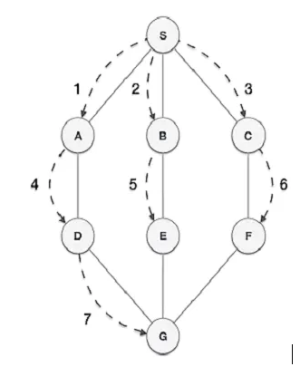

# Basics of Graphs 

## What is a graph?
Graph data structures are data structures that consist of a collection of nodes or vertices connected by edges. 

## Types of Graphs - 
1. Undirected Graph - No directions in edges 
2. Directed Graph - Directions in edges 
3. Weighted graph - In a weighted graph, edges have associated weights or costs. 
4. Cyclic Graph - A cyclic graph contains at least one cycle, which is a path that starts and ends at the same node.
5. Acyclic Graph - An acyclic graph, as the name suggests, does not contain any cycles.  

## Traversals in Graphs - 

### Breadth First Search Traversal - 

Sample code of BFS -  

from collections import deque 
def bfs(graph, start, search_value): 
    visited = set() 
    queue = deque([start]) 

    while queue:
        vertex = queue.popleft()
        if vertex == search_value:
            return True
        visited.add(vertex)
    
        for neighbour in graph[vertex]:
            if neighbour not in visited:
                queue.append(neighbour)
                visited.add(neighbour)
    return False

graph = {
    'A': ['B', 'C'],
    'B': ['A', 'D', 'E'],
    'C': ['A', 'F'],
    'D': ['B'],
    'E': ['B', 'F'],
    'F': ['C', 'E']
}

start = "F" 
search_value = "B" 
res = bfs(graph, start, search_value) 
print(f"element {search_value} : {res}") 

output : element B : True